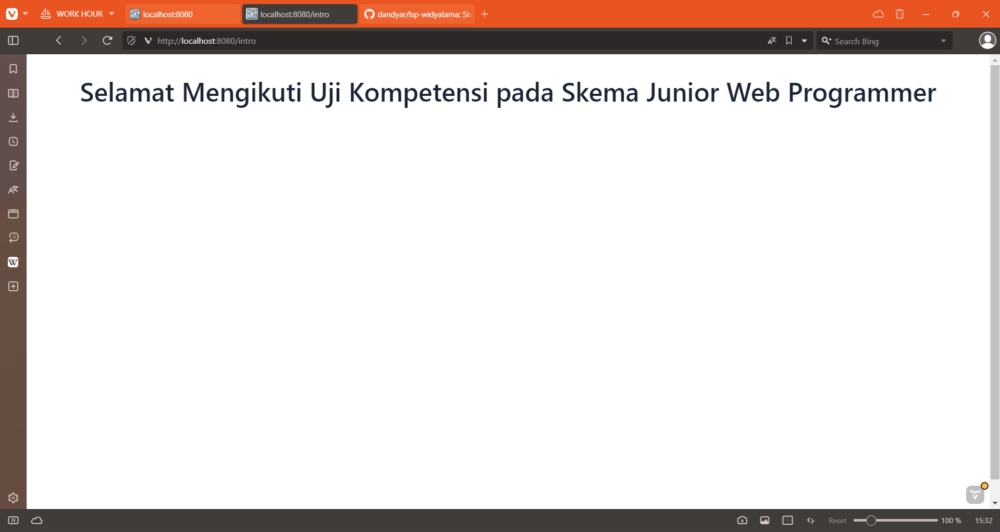
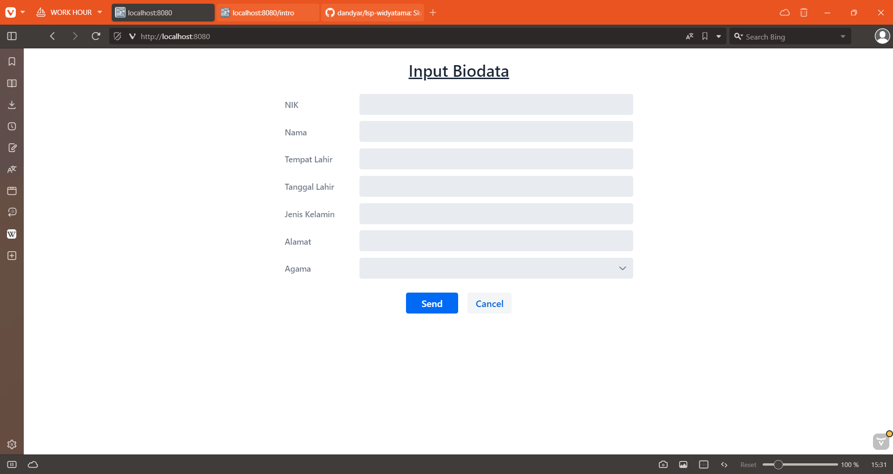

## Note
Project ini menggunakan JDK 21 dan WildFly 33.0.1.Final

## User Interface

## Program CLI untuk Menghitung Luas Segitiga

[Source code](https://github.com/dandyar/lsp-widyatama/blob/e72f114b4490f111e137fcf532e1dee05ef7118b/luas-segitiga/src/main/java/dandyar/github/io/SegitigaApp.java)

## Program CLI untuk Struktur Data Biodata

[Source code](https://github.com/dandyar/lsp-widyatama/blob/e72f114b4490f111e137fcf532e1dee05ef7118b/struktur-data/src/main/java/dandyar/github/io/MahasiswaApp.java)